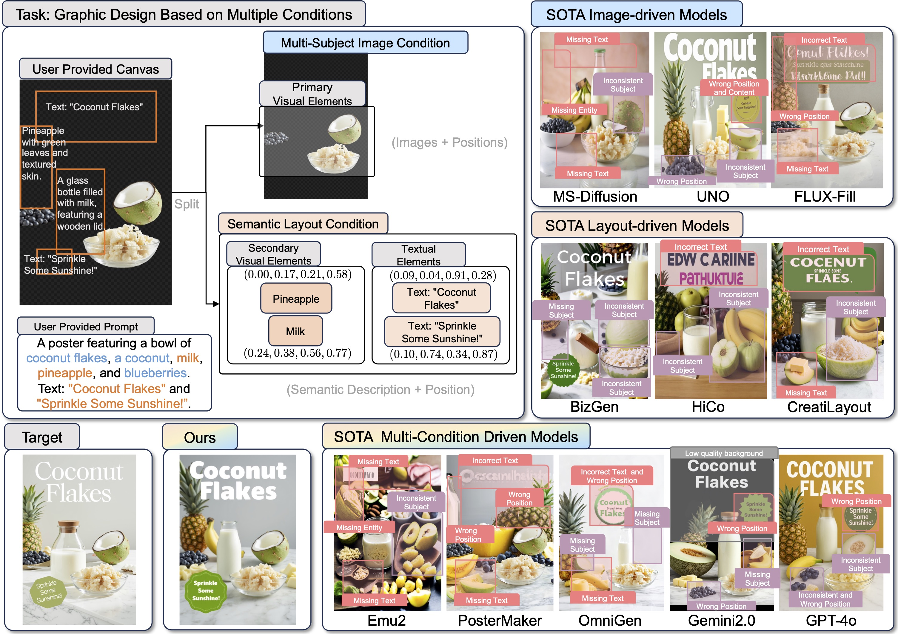

#  CreatiDesign


<br>
<a href="https://arxiv.org/pdf/2505.19114"></a>
<a href="https://huizhang0812.github.io/CreatiDesign/"></a>
<a href="https://huggingface.co/datasets/HuiZhang0812/CreatiDesign_dataset"></a>
<a href="https://huggingface.co/datasets/HuiZhang0812/CreatiDesign_benchmark"></a>
<a href="https://huggingface.co/HuiZhang0812/CreatiDesign"></a>


>    **CreatiDesign: A Unified Multi-Conditional Diffusion Transformer for Creative Graphic Design**
> <br>
> [Hui Zhang](https://huizhang0812.github.io/), 
> [Dexiang Hong](https://scholar.google.com.hk/citations?user=DUNijlcAAAAJ&hl=zh-CN), 
> Maoke Yang, 
> Yutao Cheng,
> Zhao Zhang,
> Jie Shao,
> [Xinglong Wu](https://scholar.google.com/citations?user=LVsp9RQAAAAJ&hl=zh-CN),
> [Zuxuan Wu](https://zxwu.azurewebsites.net/),
> and 
> [Yu-Gang Jiang](https://scholar.google.com/citations?user=f3_FP8AAAAAJ)
> <br>
> Fudan University & ByteDance Intelligent Creation.
> <br>

## 🎯 Introduction
CreatiDesign tackles the challenge of automated graphic design generation that requires precise control over multiple heterogeneous elements—primary visual elements (product images), secondary visual elements (decorative objects), and textual elements (slogans, titles). CreatiDesign introduces a unified multi-conditional diffusion transformer that achieves flexible and harmonious integration of diverse design elements with minimal architectural modifications.




## ✨ Key Features

- **🎨 Multi-Conditional Image Generation**: Unified architecture supporting images, semantic layouts conditions simultaneously
- **🎯 Precise Element Control**: Multimodal attention mask mechanism prevents condition interference
- **🗂️ Graphic Design Datasets**: 400K graphic design samples with multi-condition annotations construced by automatic pipeline
- **📊 Comprehensive Benchmark**: Rigorous evaluation of multi-subject preservation and semantic layout alignment.
- **✏️ Zero-Shot Editing**: Natural extension to editing tasks without additional training or retraining


## Quick Start
### Setup
1. **Environment setup**
```bash
conda create -n creatidesign python=3.10 -y
conda activate creatidesign
conda install pytorch==2.4.1 torchvision==0.19.1 torchaudio==2.4.1 pytorch-cuda=12.1 -c pytorch -c nvidia
```
2. **Requirements installation**
```bash
pip install -r requirements.txt
```


## Dataset and Benchmark
### CreatiDesign Datasets <a href="https://huggingface.co/datasets/HuiZhang0812/CreatiDesign_dataset"></a>
Our CreatiDesign dataset contains **400K high-quality graphic design samples** with comprehensive multi-condition annotations, constructed through our fully automated pipeline. The dataset covers diverse design categories including movie posters, product advertisements, brand promotions, and social media content.

### CreatiDesign Benchmark <a href="https://huggingface.co/datasets/HuiZhang0812/CreatiDesign_benchmark"></a>
Our comprehensive benchmark contains **1,000 carefully curated samples** designed to rigorously evaluate graphic design generation capabilities across multiple dimensions. The benchmark assesses both fine-grained condition adherence and overall visual quality.

To evaluate the model's graphic design generation capabilities through our benchmark, follow these steps:

Generate images:
```python
python test_creatidesign_benchmark.py
```
Evaluate multi-subject preservation:
```python
python eval/subject.py
```
Evaluate semantic layout alignment:
```python
python eval/layout.py
```
```python
python eval/text.py
```


## Models
**Multi-Conditional Graphic Design:**
| Model   | Base model    |  Description  |
| ------------------------------------------------------------------------------------------------ | -------------- | -------------------------------------------------------------------------------------------------------- |
| <a href="https://huggingface.co/HuiZhang0812/CreatiDesign"></a> | FLUX.1-dev | model used in the paper

## ✒️ Citation

If you find our work useful for your research and applications, please kindly cite using this BibTeX:

```latex
@article{zhang2025creatidesign,
  title={CreatiDesign: A Unified Multi-Conditional Diffusion Transformer for Creative Graphic Design},
  author={Zhang, Hui and Hong, Dexiang and Yang, Maoke and Chen, Yutao and Zhang, Zhao and Shao, Jie and Wu, Xinglong and Wu, Zuxuan and Jiang, Yu-Gang},
  journal={arXiv preprint arXiv:2505.19114},
  year={2025}
}
```
